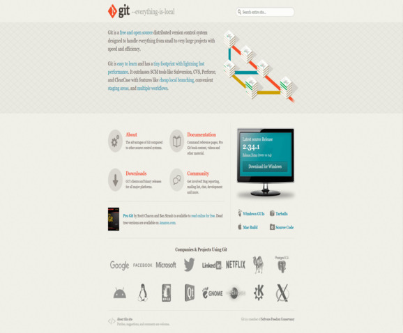
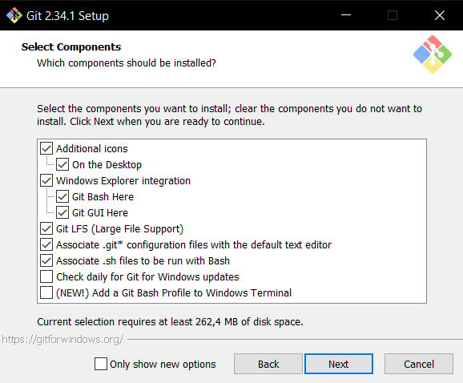

***[Содержание](./readme.md)***

## Установка GIT

---

Для этого достаточно зайти на ***[сайт](https://git-scm.com 'Ссылка на сайт')*** GIT и скачать установщик на свой компьютер

Во время установки будет много дополнительных пунктов в которых не обязательно что-то выбирать, можно просто жать Next

---
